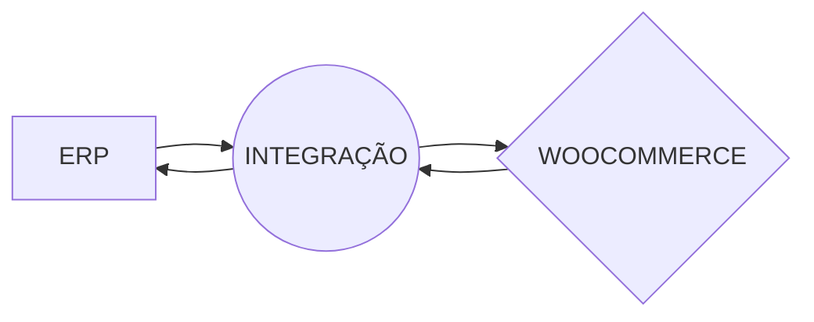

# Integração WooCommerce ERP!

Esse repositório é para manter códigos de integrações do WooCommerce com os ERP de mercado. Fique a vontade para contribuir com outros ERP.
Se você não é desenvolvedor e precisa integrar com outro ERP entre em contato conosco.

# Sincronização

Esta aplicação tem por sua vez realizar a syncronização dos dados do WooCommerce com os do ERP.

O que será sincronizado pode ser parametrizado, veja o que tem:

- Clientes.
	> A aplicação fará a sincronização dos clientes do WooCommerce com os do ERP e do ERP com os do WooCommerce.

- Produtos e estoque.
	> Todos os produtos são replicados para o outro software e o estoque é sincronizado.

- Vendas.
	> Todos as vendas realizadas no WooCommercer são enviadas para o ERP que por sua vez fará a atualização de estoque e toda a parte fiscal, como as NF-e.

## Metodologia

Esta aplicação roda como um serviço a parte, ela pode ficar hospedada em um servidor diferente do servidor do e-commerce e ou do ERP, podendo até ser hospedada em um servidor local. Como funciona:

Veja o fluxograma:

A integração, isso é, esta aplicação, pode se comunicar com um ou muitos ERP's e um ou muitos E-commerce's ao mesmo tempo.

## ERP's

Lista dos ERP's que está aplicação atende.

 - Pebbian

